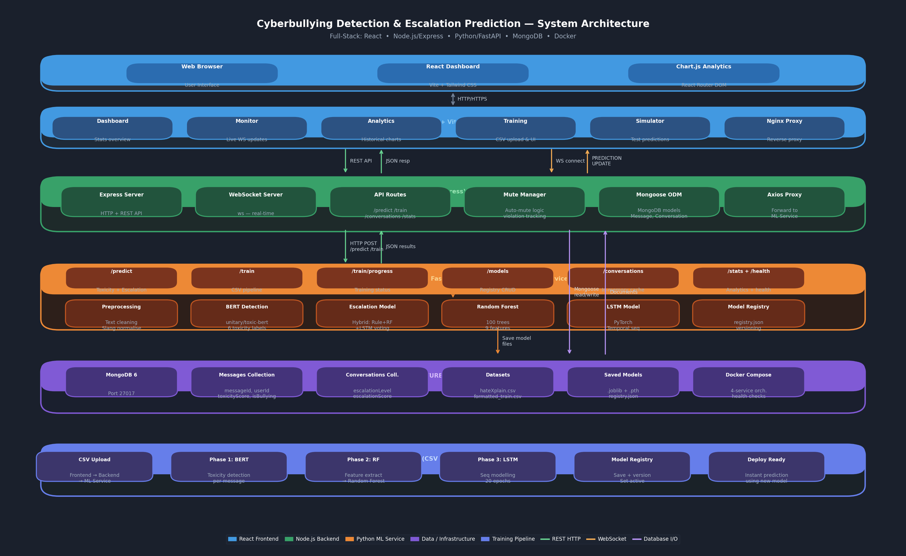

# Cyberbullying Detection & Escalation Prediction 🛡️

A production-ready, full-stack application that detects cyberbullying in messages and predicts conversation escalation risk in real-time. Built with a React dashboard, Node.js WebSocket backend, and Python FastAPI Machine Learning service.

## 🧱 Architecture



> The diagram above shows all layers of the system and the data-flow between them.
> To regenerate the diagram, run: `python docs/generate_architecture_diagram.py`

The application is composed of four services orchestrated via Docker Compose:

| Layer | Service | Technology | Port |
|-------|---------|------------|------|
| **Client** | Web Browser / React UI | React 18, Vite, Tailwind CSS, Chart.js | — |
| **Frontend** | Dashboard & Pages | React Router DOM, Axios, Nginx | 5173 |
| **Backend** | API & WebSocket server | Node.js, Express, MongoDB (Mongoose), ws | 5000 |
| **ML Service** | Prediction & Training | Python 3.10, FastAPI, PyTorch, Scikit-learn, HuggingFace | 8000 |
| **Database** | Persistence | MongoDB 6 | 27017 |

### Key data flows

1. **Prediction flow:** Browser → React → `POST /api/predict` (Backend :5000) → `POST /predict` (ML Service :8000) → BERT detection + Hybrid escalation → results persisted to MongoDB → broadcast via WebSocket to all clients.
2. **Training flow:** CSV upload → React → `POST /api/train` (Backend) → `POST /train` (ML Service) → Phase 1 (BERT toxicity labels) → Phase 2 (Random Forest, 100 trees) → Phase 3 (PyTorch LSTM, 20 epochs) → models saved to `saved_models/` and registered.
3. **Analytics flow:** React → `GET /api/stats` (Backend) → MongoDB aggregation → Chart.js visualisations.

---

## 🚀 Getting Started (Docker Compose - Recommended)

The easiest way to run the entire stack is using Docker Compose.

1. Install Docker and Docker Compose.
2. Open terminal in the root directory.
3. Run the following command:
   ```bash
   docker-compose up --build
   ```
4. Access the applications:
   - **Frontend UI:** `http://localhost:5173`
   - **Backend API:** `http://localhost:5000`
   - **ML Service Docs:** `http://localhost:8000/docs`


## 💻 Local Setup (Without Docker)

If you prefer to run services manually, follow these steps:

### Prerequisites
- Node.js (v18+)
- Python (3.10+)
- MongoDB server running on `localhost:27017`

### 1. ML Service
```bash
cd ml-service
pip install -r requirements.txt
uvicorn main:app --reload --port 8000
```

### 2. Backend
```bash
cd backend
npm install
npm run dev
```

### 3. Frontend
```bash
cd frontend
npm install
npm run dev
```

---

## 🧠 Training the Models

Before the Live Monitor works accurately, you need to train the models:

1. Go to the **Train Data** tab (`http://localhost:5173/upload`).
2. Upload the sample dataset located at `ml-service/data/sample_dataset.csv`.
3. Click **Start Training**.
4. The models will be saved to `ml-service/saved_models/` and are immediately ready for prediction.

---

## 🚨 Features

- **Toxicity Prediction:** Identifies individual abusive or toxic messages using NLP.
- **Contextual Escalation Risk:** Groups messages by conversation to calculate escalation trends (LOW / MEDIUM / HIGH risk).
- **Real-Time WebSockets:** New predictions instantly appear on the dashboard without refreshing.
- **Analytics Dashboard:** Visualizes toxicity trends and risk buckets using Chart.js.
